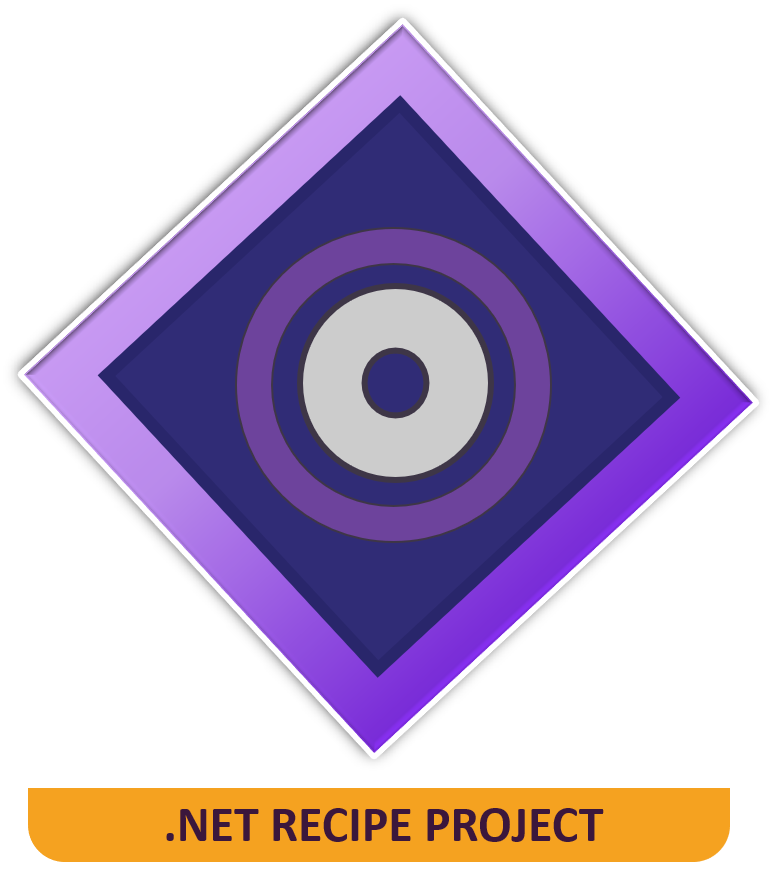

<p align="center">
  <a href="#">
      
  </a>

  <h1 align="center">Clean Architecture</h1>

  <p align="center">
    A complete step-by-step shell script commands for recreating a clean architecture
    for any dotnet version. Use all script blocks or customize as you prefer.
    <br />
    <a href="https://github.com/felipeAguiarCode/dotnet-clean-arch-recipe/blob/main/docs/recipe.md"><strong>Go to create script »</strong></a>
    <br />
    <br />
    <a href="https://github.com/felipeAguiarCode/dotnet-clean-arch-recipe/issues">Report Bug</a>
    ·
    <a href="https://github.com/felipeAguiarCode/dotnet-clean-arch-recipe/issues/new">Request Feature</a>
  </p>
</p>

## Preview


## About this project

### 🔘 Domain

This will contain all entities, enums, exceptions, interfaces, value objects, types and logic specific to the domain layer.

### 🧠 Application

This layer contains all application logic. It is dependent on the domain layer, but has no dependencies on any other layer or project.

### 🛠 Infrastructure

This layer contains classes for accessing external resources such as file systems, web services, database, smtp, etc.

### 🌐 WebApi / UI

This layer is a public layer to serve a external client by webapi or serve a webview.

## Building scripts

You'll need [dotnet-sdk](https://dotnet.microsoft.com/en-us/download) installed on your computer in order to build this app.
S
Recipe to create a clean arch based project

### 🔧 Create Folders Structure

```bash
    mkdir src
    mkdir -p src/Infrastructure, src/Domain
    mkdir -p src/Application, src/WebApi
```

### 🔧 Create Projects

```cs
    dotnet new classlib --output "src/Domain" --name "Domain"
    dotnet new classlib --output "src/Application" --name "Application"
    dotnet new classlib --output "src/Infrastructure" --name "Infra"
    dotnet new webapi --output "src/WebApi" --name "WebApi"
```

### 🔧 Create Solution and add projects

```cs
    dotnet new sln --output "src" --name "CleanApi"
    dotnet sln src/CleanApi.sln add src/Application/Application.csproj
    dotnet sln src/CleanApi.sln add src/Domain/Domain.csproj
    dotnet sln src/CleanApi.sln add src/Infrastructure/Infra.csproj
    dotnet sln src/CleanApi.sln add src/WebApi/WebApi.csproj
```

### 🔧 Add References

```cs
    dotnet add src/Application/Application.csproj reference src/Domain/domain.csproj

    dotnet add src/Infrastructure/Infra.csproj reference src/Application/Application.csproj

    dotnet add src/WebApi/WebApi.csproj reference src/Application/Application.csproj
    dotnet add src/WebApi/WebApi.csproj reference src/Domain/domain.csproj
    dotnet add src/WebApi/WebApi.csproj reference src/Infrastructure/Infra.csproj
```

## Usage

Use the build scripts to generate the project or clone this repository and just use it.

🔧 Then Run the script

```bash
git clone https://github.com/felipeAguiarCode/dotnet-clean-arch-recipe.git
$ cd dotnet-clean-arch-recipe
$ dotnet restore src/WebApi
$ dotnet run --project src/webapi/webapi.csproj
```

## Features / Todo

🚧 **This project is under development** 🚧

- [x] Create clean arch folder structure;
- [x] Create clean arch projets;
- [x] Create solution and add references projects;
- [ ] Create scripts to create a test project;
- [ ] Create scripts to add common thirdparty libraries;

## Give a Star! ⭐

If you like or are using this project to learn or start your solution, please give it a star.

## Autor

| [<br><sub>Felipe Aguiar</sub>](https://github.com/felipeAguiarCode) |
| :---------------------------------------------------------------------------------------------------------------------------------------: |
|                                             [Linkedin](www.linkedin.com/in/felipe-aguiar-exe)                                             |
